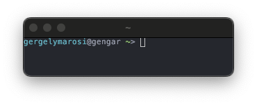

## Fish

#### About
I opt for the Fish shell due to it's suggestions, smart tab completions, and syntax highlighting, but I use bash for scripting.  

#### How I use it?
* I write my scripts in bash and use the `#!/bin/bash` shebang line in my scripts.
* I only use fish’s scripting language to configure fish in `config.fish`  
* Instead of using fish functions I write bash sripts and add my `bin` folder to the `PATH`
* Instead of adding stuff the fish way, i put every persistance changes to the `config.fish` file. (Like adding to PATH)

#### Modifications
* I use the One Dark theme like everywhere it's possible.

  

#### Credits
* The idea to use `jethrokuan/z` from [Markus Dosch](https://www.markusdosch.com/2022/10/customizing-my-shell-from-bash-to-zsh-to-fish/)
* [OneDark theme](https://github.com/rkbk60/onedark-fish/tree/master)
